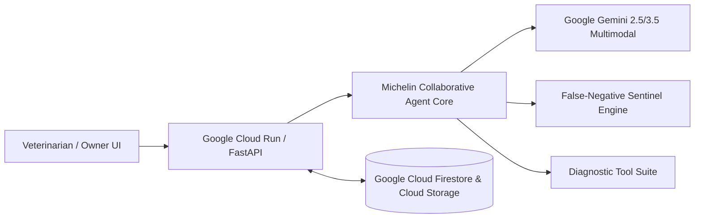

# 🐾 Michelin — Collaborative Feline Clinical Co-Pilot
**Autonomous Multimodal Diagnostic Partner for Veterinary Medicine**
*Google Cloud "All Things Agentic" Hackathon Submission — The Collaborative Partner Track*

---

## 🌟 Overview

**Michelin** is an intelligent, multimodal veterinary clinical co-pilot powered by **Google Gemini 2.5/3.5 Pro** and **Google Cloud**. It is designed to prevent delayed and missed feline diagnoses by synthesizing longitudinal patient health records (digital radiographs, blood panels, ultrasounds, consultation notes, and owner observation logs). 

Unlike traditional passive chatbots, Michelin actively collaborates with the veterinarian:
* **Proactive Clinical Inquiries**: Identifies missing diagnostic tests and suggests high-yield clinical questions.
* **False-Negative Sentinel**: High-sensitivity detection for conditions like Feline Infectious Peritonitis (FIP), Hypertrophic Cardiomyopathy (HCM), and Chronic Kidney Disease (CKD).
* **Live Differential Diagnosis Matrix**: Generates probability rankings, rule-out protocols, and immediate therapeutic actions grounded in AAFP & WSAVA guidelines.
* **Real-World Pilot**: Actively tested with real data at a veterinary clinic in Aguascalientes, Mexico.

---

## 🚀 Quickstart & Spin-Up Guide

### Prerequisites
* Python 3.10 or 3.11
* (Optional) Docker for containerized deployment
* (Optional) Google Gemini API Key from [Google AI Studio](https://aistudio.google.com/)

---

### Option A: Local Python Spin-Up (Fastest)

1. **Clone the repository:**
   ```bash
   git clone https://github.com/your-username/michelin-vet-copilot.git
   cd michelin-vet-copilot
   ```

2. **Create and activate a virtual environment:**
   ```bash
   # Windows (PowerShell)
   python -m venv venv
   .\venv\Scripts\Activate.ps1

   # macOS / Linux
   python3 -m venv venv
   source venv/bin/activate
   ```

3. **Install dependencies:**
   ```bash
   pip install -r backend/requirements.txt
   ```

4. **Configure Environment Variables:**
   ```bash
   cp .env.example .env
   # Edit .env and paste your GEMINI_API_KEY (or run with built-in heuristic clinical engine)
   ```

5. **Start the Application:**
   ```bash
   uvicorn backend.app.main:app --host 127.0.0.1 --port 8000 --reload
   ```

6. **Open in your browser:**
   Navigate to [http://127.0.0.1:8000](http://127.0.0.1:8000) to access the interactive clinical dashboard.

---

### Option B: Docker Container Spin-Up

1. **Build the container image:**
   ```bash
   docker build -t michelin-vet-copilot -f backend/Dockerfile .
   ```

2. **Run the container:**
   ```bash
   docker run -p 8080:8080 -e GEMINI_API_KEY="your_api_key" michelin-vet-copilot
   ```

3. **Access the App:**
   Open [http://localhost:8080](http://localhost:8080).

---

### Option C: Deploy to Google Cloud Run

Deploy directly to Google Cloud using the Google Cloud SDK (`gcloud`):

```bash
# 1. Set your GCP project
gcloud config set project YOUR_PROJECT_ID

# 2. Build and submit image to Cloud Build
gcloud builds submit --config cloudbuild.yaml

# 3. Or deploy directly via Cloud Run command:
gcloud run deploy michelin-vet-copilot \
  --source . \
  --region us-central1 \
  --platform managed \
  --allow-unauthenticated \
  --set-env-vars GEMINI_API_KEY="your_key"
```

---

## 🏛️ System Architecture



For the complete architectural breakdown, see [docs/ARCHITECTURE.md](docs/ARCHITECTURE.md).

---

## 📂 Project Structure

```
michelin-vet-copilot/
├── backend/
│   ├── app/
│   │   ├── __init__.py
│   │   ├── main.py                  # FastAPI REST API & Static Mounting
│   │   ├── agent.py                 # Gemini Collaborative Partner Agent
│   │   ├── tools.py                 # Radiology, Biomarker & Literature Tools
│   │   ├── clinical_safety.py       # False-Negative Sentinel & Guardrails
│   │   └── database.py              # Longitudinal Vault & Sample Feline Cases
│   ├── requirements.txt
│   └── Dockerfile                   # Cloud Run Production Container
├── frontend/
│   ├── index.html                   # Veterinary Clinical UI Dashboard
│   ├── css/style.css                # Medical Design & DICOM Reticle Styling
│   └── js/app.js                    # Interactive Client & Chat State
├── docs/
│   ├── DEVPOST_SUBMISSION.md        # Ready-to-Submit Devpost Text
│   ├── ARCHITECTURE.md              # Detailed Architecture & Mermaid Diagram
│   ├── VIDEO_SCRIPT.md              # 4-Minute Demo Video Script & Storyboard
│   └── BONUS_CONTENT.md             # Medium Article & Social Media Announcements
├── cloudbuild.yaml                  # GCP Automated Build Pipeline
├── .env.example
└── README.md
```

---

## 📄 License & Acknowledgements
* Built with ❤️ for feline lives everywhere in memory of Michelin.
* Created for the **All Things Agentic Hackathon** (Google Cloud & Devpost).
