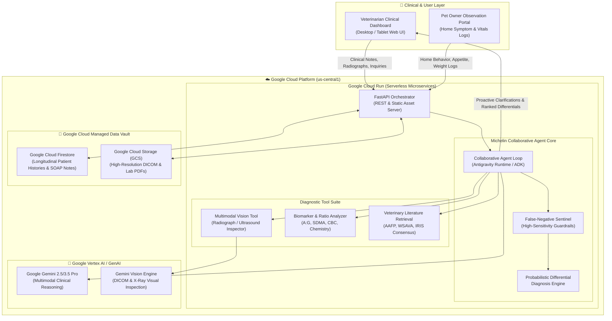

# 🏗️ Michelin Veterinary Clinical Co-Pilot — System Architecture

This document provides a technical specification of the **Michelin Veterinary Co-Pilot** system architecture, highlighting its multimodal diagnostic pipeline, bidirectional collaborative loop, and Google Cloud infrastructure.

---

## 📊 End-to-End System Architecture Diagram

---

## 🧩 Architectural Components

### 1. Presentation Layer (Veterinary Clinical UI)
* **Responsive Medical Interface**: Built with Tailwind CSS and modern JavaScript, designed specifically for rapid review during hectic clinic hours.
* **DICOM/Radiograph Viewport**: Visual overlay for thoracic/abdominal radiographs with automated lesion highlight annotations.
* **Real-Time Differential Matrix**: Displays ranked probabilities, rule-out tests, and therapeutic urgency.

### 2. Microservice Layer (Google Cloud Run)
* Hosted on **Google Cloud Run**, offering elastic scaling, instant container startup, and high availability.
* Runs Python 3.11 with FastAPI to handle asynchronous multimodal payloads, image parsing, and secure JSON APIs.

### 3. Collaborative Agent Core (Gemini + Antigravity Runtime)
* **Bidirectional Inquiry Loop**: Implements the *Collaborative Partner* paradigm by continuously comparing patient histories against diagnostic criteria and asking proactive clinical questions to the attending vet.
* **Context Synthesis**: Melds veterinarian SOAP notes, objective lab metrics, imaging findings, and owner behavioral logs into a cohesive clinical prompt.

### 4. False-Negative Sentinel & Safety Engine
* **High-Sensitivity Ratio Checkers**:
  - `A:G Ratio < 0.45`: Immediate FIP red alert and Rivalta/antiviral recommendation.
  - `SDMA > 14 ug/dL` with normal creatinine: Early CKD stage 1/2 warning.
  - `Sleeping Resp Rate > 30 bpm`: Feline cardiomyopathy / congestive heart failure alert.
* **Grounded Clinical Guidelines**: References official AAFP and WSAVA guidelines to prevent hallucinated treatments.

### 5. Persistent Data Vault (Google Cloud Firestore & Cloud Storage)
* **Cloud Firestore**: Stores semi-structured longitudinal patient timelines, vitals history, consultation records, and owner observations.
* **Cloud Storage**: Stores high-resolution radiographs, ultrasound clips, and laboratory PDF documents.

---

## 🔒 Security, Privacy & Zero-Trust Governance
* **HIPAA & Veterinary Data Compliance**: All patient records and imaging assets are encrypted in transit (TLS 1.3) and at rest (AES-256).
* **Least-Privilege IAM Roles**: Cloud Run service accounts are restricted to specific Firestore collections and Cloud Storage buckets.
